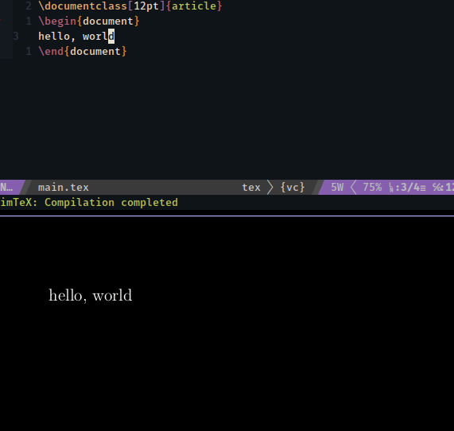

# Setup

|                  | What I use                                                                       |
|:-----------------|:---------------------------------------------------------------------------------|
| OS               | NixOS                                                                            |
| DE               | -                                                                                |
| WM               | i3                                                                               |
| Status bar       | i3blocks                                                                         |
| Terminal         | xfce4-terminal                                                                   |
| Shell            | bash                                                                             |
| Text Editor      | [neovim-goose](https://github.com/WhiteBlackGoose/neovim-goose)                  |
| IDE              | [neovim-goose](https://github.com/WhiteBlackGoose/neovim-goose)                  |
| PDF editor       | [neovim-goose](https://github.com/WhiteBlackGoose/neovim-goose)                  |
| PDF viewer       | zathura                                                                          |
| Image editor     | Pinta                                                                            |
| Image viewer     | [nsxiv-goose](https://github.com/WhiteBlackGoose/nsxiv-goose)                    |
| Markdown viewer  | [libemdview-goose](https://codeberg.org/WhiteBlackGoose/litemdview)              |
| Git UI           | lazygit                                                                          |
| Task manager     | -                                                                                |
| File manager     | -                                                                                |
| Password manager | [pass](https://gist.github.com/WhiteBlackGoose/8ffb7123b991dcc4cdafcdd574bdc3c6) |
| Font             | FiraCode Nerd                                                                    |
| Browser          | firefox, surf, Tor                                                               |
| Currency         | BTC, ETH                                                                         |
| App launcher     | rofi                                                                             |

# nvim

To get my setup of nvim:

> **Note**
> ❄️  - means it's already part of my NixOS setup, so if you're installing it, you don't need to install this package yourself.

- ❄️ Get `neovim-goose` (my fork)
  - ❄️ `pip3 install neovim` for deoplete
  - ❄️ Get `lazygit` for git UI
  - ❄️ .NET
    - ❄️ [Install](https://learn.microsoft.com/en-us/dotnet/core/tools/dotnet-install-script#recommended-version) .NET (using binaries works too)
    - ❄️ Install [netcoredbg](https://github.com/Samsung/netcoredbg) and replace the path in the config somewhere to it
    - ❄️ Make sure that your $PATH has no `~` (neovim can't expand it)
    - ❄️ Make sure your DOTNET_ROOT is set to the place where your actual binaries are
  - ❄️  F#
    - ❄️  `:Mason`, find `fsautocomplete`, press `i`
  - ❄️ Python
    - ❄️ `pip install flake8`
    - ❄️ `pip install debugpy`
    - ❄️ `pip install jedi-language-server`
  - Any interactive
    - ❄️ `pip install jupyter_client` for interactive
    - ❄️  `:UpdateRemotePlugins`
    - ❄️ `pip install pyperclip`
  -  .NET interactive (C#, F#)
    - ❄️  `dotnet tool install -g Microsoft.dotnet-interactive`
    - `dotnet interactive jupyter install`
  - Rust
    - Get [vscode-lldb](https://github.com/vadimcn/vscode-lldb/releases)
    - Unpack vsix
    - Update paths in the config file
  - ❄️ C
    - ❄️ Install clangd
  - LaTeX
    - ❄️ Get `latexmk`
    - ❄️ Get `zathura` (PDF viewer)
    - Get `amcli` (AngouriMathCLI) (optional)
    - ❄️ Get `texlab` (Language server) (optional)
    - ❄️ Get `pygmentize` (python syntax highlighting) (optional)
  - ❄️ Image
    - ❄️ `ascii-image-converter`
  - ❄️ Markdown
    - ❄️ `litemdview`

### Why nvim?

- ✅ Start up time (< 500 ms is not noticeable by human)
- ✅ Responsiveness (no GUI - no lags)
- ✅ Customisation. It's all lua. You almost write your own IDE, given components. Glue them together and add/remove whatever you want
- ✅ Suitable to run over terminal SSH. So you can literally use a full-blown IDE from a tablet
- ✅ Optimized for hotkeys. It's impossible to use mouse, so 100% everything is reachable from keyboard
- ✅ Opens in the same window as your shell, not poping up (because no GUI)
- ✅ You certainly can copy any part of the window because ... it's all text
- ✅ FOSS
- ❌ Ridiculous learning curve. It's not that you *just* need to learn the completely alien to most modern people keybindings, you also have to learn installing and configuring plugins, and soon, coding some basics in lua as well as basics of interacting with `nvim` itself. Meanwhile in Visual Studio you need to click two buttons and you're set
- ❌ Availability. For example, I couldn't find a test explorer for neovim for .net

### Features for developers

- Suggestions for C#, Rust, C work
  - Semantic completions pop up as you type
  - Disable errors/warnings with `Ctrl+q`
  - Enable list of errors and warnings in a file with `Ctrl+p`
- Suggestions for F# work
  - Not tested extensively though. Activate them with Ctrl+space
- Warnings and errors for C#, Rust, Python, C
  - With virtual text (which appears on the same line with error)
  - Works for both themes
- Quick fixes for C#
- Warnings and errors for F#
  - Not yet customised properly
  - But works for both themes
- Debug .NET, Rust, python
  - F5 to start. Before starting .NET, it suggests compilation (y/n) and changing path to dll (y/n if already prompted once)
  - F10/Ctrl+F10 for step over/in, F4 to stop, F7/F8 to show/hide repl
  - Hover over a variable
  - Build .NET project with `Ctrl+B`
- Interactive C#, F#, Python
  - Start typing `:MagmaInit`, see the options
  - Once initialized, `<space>mm` runs the line in normal mode or selected block in visual mode
- Symbols
  - Hover preview documentation
  - Hover preview definition
  - Go to definition
  - Rename symbol
  - See symbols in the current file
- Tests
  - Run tests in a file
  - Run the test  
- Alt+@ for F# interactive
- Rainbow brackets
- Git
  - Git signs (shows which lines are added/modified since the last commit)
  - Open lazygit on hotkey
- Html auto closing and tag renaming
- Folding with `<leader>j` and `<leader>k`
- `mim` or `minimal vim` - nvim without NerdFont symbols - is suitable for using neovim over ssh

### Other features

- Toggle the theme with ` the` (or run `wim` for the white theme and `vim` for the default/dark one)
- Files
  - Toggle the file tree with Alt+T
  - Alt+, and Alt+. to switch between tabs
- Telescope
  - `<leader>F` to find among files
  - `<leader>cc` to find among commands
  - `<leader>fb` to find among buffers
  - `<leader>co` to find among commits
  - `<leader>man` to see man entries
- Search
  - Over files with `<leader>F`
  - In files with `<leader>fff`
  - And many more searches
- LaTeX support
  - Edit LaTeX in nvim and preview hot-reloaded PDFs in Zathura
  - Language server (errors, completions)
  - Convert math expressions into LaTeX with hotkeys
  - A bunch of templates for math papers, presentations, etc. (see `:Template`)
- Image preview
- Markdown preview
  - `:MdView`

#### The rest see the config...

# starship

- Just pretty yet minimalistic config for starship shell
- Shows time: useful when you want to see when a command was run

# i3

- Borderless, very minimalistic
- Xfce apps configured as floating
- Menu is `xfce-appfinder`. Stupid, simple
- `i3blocks` configured for some info about your system

# Screenshots

### 2022-11-23 13:15 UTC

### 2022-11-04 06:03 UTC

See branch freebsd for dot files.

### 2022-11-03 16:48 UTC

See branch arch for dot files.

### 2022-10-21 07:31 UTC

### 2022-09-02 10:48 UTC

### 2022-08-31 21:30 UTC

### 2022-08-31 11:13 UTC

### 2022-08-27 12:46 UTC

### 2022-08-23 15:01 UTC

### 2022-08-10 19:26 UTC

# My changes

Basically list of my own changes here to make myself more comfortable, besides obviously the config available here

- nvim: barbar integration with NvimTree
- nvim: evaluate code in magma-nvim in expression
- nvim: copy the output of magma-nvim into clipboard
- nsxiv-goose: inversion of color
- nvim: folding without unnecessary numbers
- nvim: window tearing fixed
- nvim: maintain a fork of magma-nvim with other cool features
